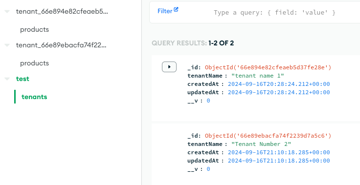
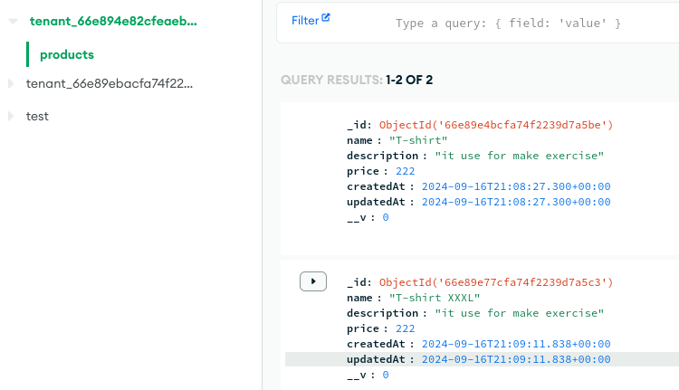
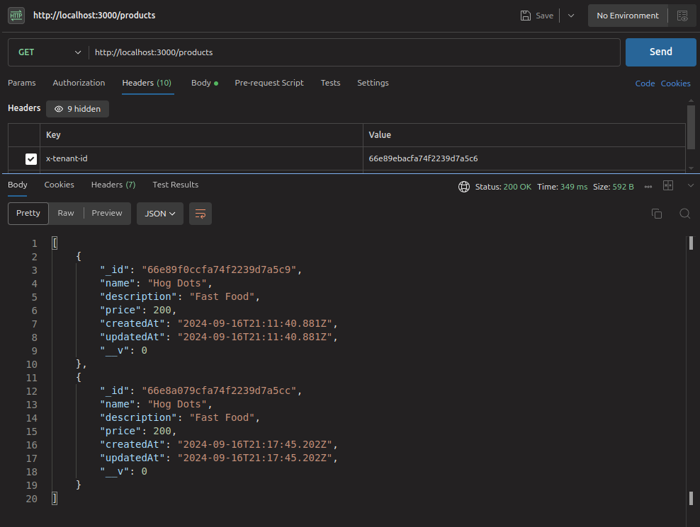
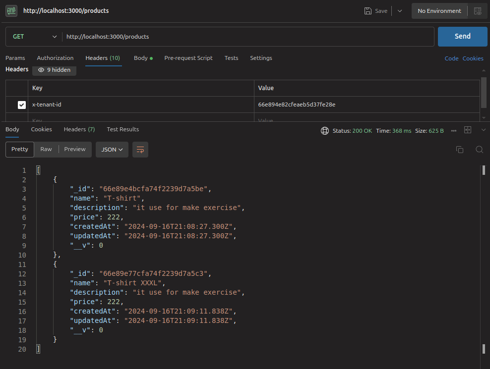

<p align="center">
  <a href="http://nestjs.com/" target="blank"></a>
</p>

# 🛍️ Products Multi-Tenant Backend

Este es un proyecto backend construido con [NestJS](https://nestjs.com/) y utilizando [pnpm](https://pnpm.io/) como manejador de paquetes. La aplicación implementa operaciones CRUD (Crear, Leer, Actualizar y Eliminar) sobre un esquema de productos, soportando múltiples tenants bajo el concepto de **multi-tenancy** y arquitectura **hexagonal**. También se utiliza **MongoDB** como base de datos.

## 🏗️ Tecnologías Utilizadas

- **NestJS**: Framework para crear aplicaciones backend en Node.js.
- **pnpm**: Manejador de paquetes rápido y eficiente.
- **MongoDB**: Base de datos NoSQL para almacenar los productos.
- **Arquitectura Hexagonal**: Diseño que promueve la separación de responsabilidades.
- **Multi-Tenant**: Permite manejar múltiples tenants en una sola instancia de la aplicación.

## 🚀 Características

- CRUD completo para productos.
- Implementación de multi-tenancy.
- Arquitectura hexagonal para mantener una estructura limpia y escalable.
- Base de datos basada en MongoDB.

## ⚙️ Funcionamiento

1. **Creación del Tenant**: Inicialmente, se debe crear un tenant.
2. **Identificación del Tenant**: El tenant se identifica mediante el encabezado HTTP `x-tenant-id`, el cual se envía en cada solicitud.
3. **Esquema del Tenant**: Cada tenant tiene su propio esquema de base de datos, que se crea con el formato `tenant_[tenantId]`. En este esquema se almacenarán todos los productos asociados a dicho tenant.

## 📦 Instalación y Ejecución

Sigue los siguientes pasos para instalar y ejecutar la aplicación en tu entorno local.

### 1. Clonar el repositorio

```bash
git clone https://github.com/GermanAlexis/products-multitens.git
cd products-multitens
```

### 2. instalar PNPM

```
pnpm install
```

### 2. Correr el proyecto

```
pnpm start:dev
```

### Pasos Clave

## 🗄️ Estructura de MongoDB por Tenant

Cada tenant tiene su propio esquema con el formato `tenant_[tenantId]`. A continuación, se muestra cómo se ve la estructura en MongoDB:

1. **Vista General de los Schemas**:
   

2. **Colección de Productos por Tenant**:
   

## 🖼️ Evidencias del Resultado

A continuación, se muestran algunas imágenes que evidencian el funcionamiento de la aplicación:

1. **Listado de Productos por Tenant**:
   ![Listado de productos  tenant # 66e89ebacfa74f2239d7a5c6 ]
   
   ![Listado de productos  tenant # 66e894e82cfeaeb5d37fe28e ]
   
